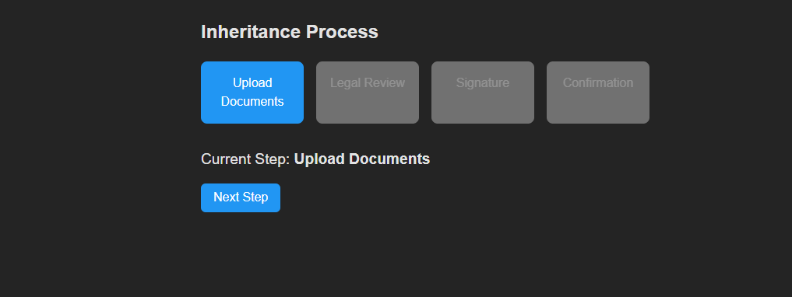

# 🧾 Heredamos Stepper Component

A simple and interactive React stepper component designed for an inheritance management portal. It guides users through multiple steps (e.g., document upload, legal review, signature, confirmation) with clear visual feedback and state persistence.

## 📦 Tech Stack

- ✅ React (Vite)
- ✅ Vanilla CSS (modular and customizable)
- ✅ `localStorage` for state persistence

## 🧠 Features

- Step-by-step process navigation.
- "Next Step" logic with controlled progression.
- Ability to go back to previous steps.
- Unlocked steps remain accessible even after returning.
- Final step shows a loading spinner and a success message.
- Persistent state across page refreshes.
- "Restart" button to reset the entire flow.

## 🖼️ Preview

 <!-- Optional: add a screenshot if available -->

## 🚀 Getting Started

### 1. Clone the repo

```bash
git clone https://github.com/your-username/heredamos-stepper.git
cd heredamos-stepper
```

### 2. Install dependencies

```bash
npm install
```

### 3. Run the development server

```bash
npm run dev
```

Open `http://localhost:5173` in your browser.

## 📄 Usage

The component is self-contained. You can import and use it in your app like this:

```jsx
import Stepper from "./components/Stepper";

function App() {
  return <Stepper />;
}
```

## 🔄 Resetting Progress

To restart the flow from scratch, click the `Restart` button at the end, or manually clear `localStorage`:

```js
localStorage.removeItem("stepperState");
```
